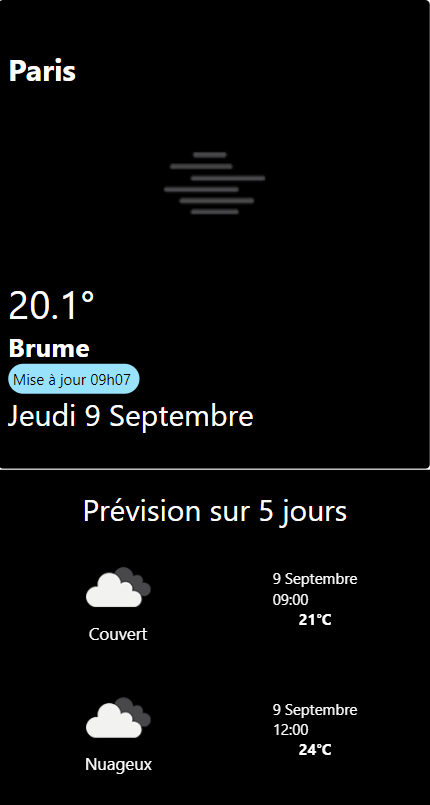

# A react Native méteo App
  
## final result 👆

## use 
### 1.  install dependencie
```bash
yarn
```
**or** 
```bash
npm install
```
### 2. Start the project 

```bash
yarn start
```
**or**
```bash
npm start
```

if you have the expo app on your phone, you can flash the QR code to use the app directly on your phone.  
All devices must be on the same wifi.


The data come from [https://openweathermap.org/api](https://openweathermap.org/api)  
Create a API key and put it the env file.